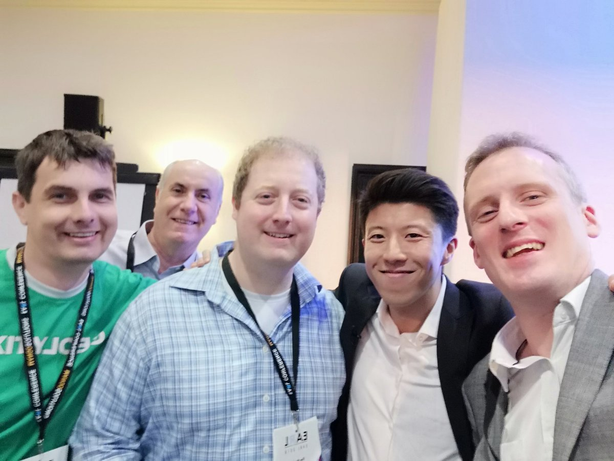

## My packages

I've authored four R packages, which are all available on [GitHub](https://www.github.com/martinctc):

* [surveytoolbox](https://www.github.com/martinctc/surveytoolbox)
* [tstoolbox](https://www.github.com/martinctc/tstoolbox)
* [rwa](https://www.github.com/martinctc/rwa)
* [textworks](https://www.github.com/martinctc/textworks)

These packages were to some extent "by-products" of the analysis that I've been doing for the last couple of years, which I decided would have greater value developed into packages. If you have any comments or questions about these packages, please get in touch - any feedback would be valuable!

---

## Blogs

On this same site you can find my [blog](https://martinctc.github.io/blog), where I write about things related to #rstats and data science. I contribute my blogs to [r-bloggers](https://www.r-bloggers.com/) and [R Weekly](https://rweekly.org), which you can find as an example two of my blogs featured in the [2019 Week 17 update](https://rweekly.org/2019-17.html) on R Weekly.

---

## EARL Conference 2018 

  

  

I presented at the EARL Conference 2018 on the challenges of using R for market research, and outlining some of the packages and approaches that help overcome these challenges. 

Check out my blog on using R for market research and strategy planning below:
[Swiss Army Knife for Strategy Planning](http://www.rainmakerscsi.com/blog/swiss-army-knife-strategy-planning)

<a href="downloads/EARL 2018 - Swiss Army Knife for Market Research - Martin Chan - 10 September 2018.pdf#" class="download" title="Download slides as PDF">Download slides</a>

---

## Interview with Jonathan Ng

[Jonathan Ng](https://datastrategywithjonathan.com/) is a best-selling instructor and Data Scientist who interviewed me on how I use R in a market research and consulting environment, and my personal journey from Excel to R. Check out the full interview here:

<iframe width="560" height="315" src="https://www.youtube.com/embed/o9wHpvIYBDM" frameborder="0" allowfullscreen></iframe>